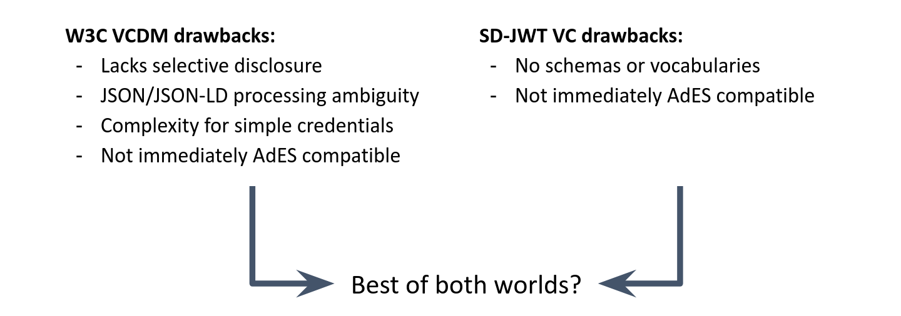
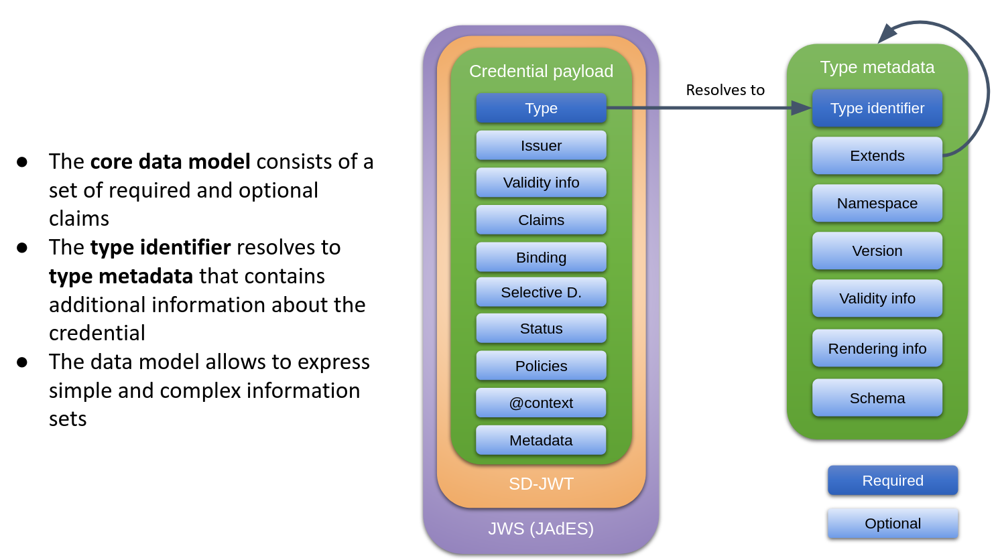

# SD-JWT VC DM Credential Format

SD-JWT VC DM is a data model that works with JWT, VCDM v2 and CBOR. With the
recommended securing mechanisms, it forms a full-fledged credential format for
verifiable credentials.

This proposal was developed by Alen Horvat, Oliver Terbu, and Daniel Fett.

## Problem Statement

While several credential formats exist for JSON-based credentials, the existing
formats all bring considerable drawbacks. For examples, W3C VCDM lacks features
for selective disclosure, introduces JSON-LD syntax (and potentially processing)
even for simple credentials and brings a significant complexity. SD-JWT VC
however lacks features for schemas and vocabularies. Neither is immediately
compatible to the *AdES family of signature standards that are widely used in
Europe.



The SD-JWT VC Data Model aims to combine the best of both worlds: It allows for
compact payloads supporting selective disclosure, schemas and vocabularies, but
is compatible with existing use cases using JSON-LD payloads. The securing
mechanisms are aligned with JAdES, allowing for a seamless integration with
existing signature standards.

## Feature Overview

| Feature                                                   | SD-JWT VC | VCDM | SD-JWT VC DM |
| --------------------------------------------------------- | --------- | ---- | ------------ |
| (Q)EAAs with nested data structures and arrays            | 🟩         | 🟩    | 🟩            |
| Simple credentials                                        | 🟩         | ❌    | 🟩            |
| Schemas and Vocabularies                                  | ❌         | 🟩    | 🟩            |
| Selective Disclosure                                      | 🟩         | ❌    | 🟩            |
| Signing Algorithms (ETSI/SOG-IS)                          | 🟩         | 🟩    | 🟩            |
| Well-defined AdES compatibility                           | ❌         | ❌    | 🟩            |
| Key Binding Approaches (cryptographic, non-cryptographic) | 🟩         | 🟩    | 🟩            |
| Short, Medium, and Long-Lived Credentials                 | 🟩         | 🟩    | 🟩            |
| Different Identifiers (x509-based, cnf, DIDs)             | 🟩         | 🟩    | 🟩            |
| Online and Offline Exchange of Credentials                | 🟩         | 🟩    | 🟩            |
| Revocation/Suspension                                     | 🟩         | 🟩    | 🟩            |
| Policies                                                  | 🟩         | 🟩    | 🟩            |

Legend: 🟩 = Supported, ❌ = Not supported

Note: This document does not define revocation or suspension mechanisms, but
provides extension points for expressing revocation and suspension information.

# Data Model



The data model of SD-JWT VC DM is based on [SD-JWT
VC](https://datatracker.ietf.org/doc/draft-ietf-oauth-sd-jwt-vc/) with the
extension [SD-JWT VC Type
Metadata](https://vcstuff.github.io/sd-jwt-vc-types/draft-fett-oauth-sd-jwt-vc-types.html)
that is planned to be integrated into one of the next versions of SD-JWT VC.

The data model generally follows JWT conventions by using `snake_case` and claim
extensions using `#` (e.g., for internationalization).

## Types and Type Metadata

SD-JWT VC Type Metadata defines an extensible mechanism for defining types of
credentials associated with various information, e.g., 

 - The type's human-readable name.
 - JSON Schema (or reference thereto).
 - Rendering information supporting internationalization.
 - Description/definition of claims.
 - An `extends` claim to identify another credential type that is extended by
   this credential type, including a hash of the extended type's metadata.
 - A default language and -script used in the claims of the credential.

The type of a credential is identified by the URI in the `vct` claim. The type
information can be resolved from this identifier, and it must be integrity
protected via a hash in a separate claim (e.g., `vct#integrity`). For more
details, see the [SD-JWT VC Type Metadata
draft](https://vcstuff.github.io/sd-jwt-vc-types/draft-fett-oauth-sd-jwt-vc-types.html).

This document does not define a unified schema for defining URIs for type
identifiers, but by supporting both URLs and URNs as type identifiers,
hierarchical type systems can be built, type identifiers can be managed in a
decentralized manner, and global uniqueness of type identifiers can be ensured.

In order to ensure that credentials can be self-contained upon issuance, glue
documents [as defined in SD-JWT Type
Metadata](https://vcstuff.github.io/sd-jwt-vc-types/draft-fett-oauth-sd-jwt-vc-types.html#name-from-type-metadata-glue-doc)
can be provided in the unprotected headers of JSON-serialized SD-JWTs.

## Data Model Interfaces

The following shows the core elements (top-level interfaces) of the proposed
data model. For easier readability, YAML syntax is used.

<details>
<summary>Show interfaces</summary>

```yaml
# (SD-JWT VC) (REQUIRED) Real digital credential type information to resolve
#             credential type metadata object as application/json. Identifier MUST be globally unique. 
# NOTE: Type inheritance and extension information is stored in the Type Metadata Object
# URI: "vct":"ELM:Diploma:FrenchDiploma" or URL:
vct: https://credentials.example.com/identity_credential
# (REQUIRED) Integrity protection of credential type metadata object. Default hash function: SHA-256
vct#integrity: sha256-asdfasdfasdf

# (Custom) (OPTIONAL) Content validity info encoded in ISO format/ RFC 3339. Note: domains and data models
# may define their own validity claims with their own validation rules. Recommendation: RFC 3339 format.
# Example from ISO 18013-5. 
# NOTE: Signature creation time and official signature timestamps are in the signature header or
# as defined per the signature profile (e.g., as iat or exp fields in a JWT-like signature).
issue_date: "2024-10-10"
expiry_date: "2034-10-10"

# (OPTIONAL) Cryptographic/Key Binding-related claims. If subject cryptographic binding is used.
cnf:
  jwk:
    kty: EC
    crv: P-256
    x: TCAER19Zvu3OHF4j4W4vfSVoHIP1ILilDls7vCeGemc
    y: ZxjiWWbZMQGHVWKVQ4hbSIirsVfuecCE6t4jT9F2HZQ


# (Custom) Subject-related claims. Simple data models and data models where all the claims are defined
# within the same namespace can put claims at the top-level. If claims are defined within different
# namespaces, `claims` must be used. Namespaces are defined below.
first_name: alice
eidas:current_family_name: asdf
claims: {}

# (OPTIONAL) Selective Disclosure related claims. If SD-JWT selective disclosure is used.
_sd_alg: sha-256
_sd:
  - 09vKrJMOlyTWM0sjpu_pdOBVBQ2M1y3KhpH515nXkpY
  - 2rsjGbaC0ky8mT0pJrPioWTq0_daw1sX76poUlgCwbI
  - EkO8dhW0dHEJbvUHlE_VCeuC9uRELOieLZhh7XbUTtA
  - IlDzIKeiZdDwpqpK6ZfbyphFvz5FgnWa-sN6wqQXCiw
  - JzYjH4svliH0R3PyEMfeZu6Jt69u5qehZo7F7EPYlSE
  - PorFbpKuVu6xymJagvkFsFXAbRoc2JGlAUA2BA4o7cI
  - TGf4oLbgwd5JQaHyKVQZU9UdGE0w5rtDsrZzfUaomLo
  - jdrTE8YcbY4EifugihiAe_BPekxJQZICeiUQwY9QqxI
  - jsu9yVulwQQlhFlM_3JlzMaSFzglhQG0DpfayQwLUK4

# (IA) (OPTIONAL) JSON-LD context. If JSON-LD is used.

@context:
  - https://w3c.org/credentials/v2


# (SD-JWT VC) (CONDITIONAL) if status/revocation information about
#               the credential is expressed
status:
  # has to be defined as an URI
  status_list:
    idx: 1234
    uri: https://example.com/status
  ec:edu:revocation:
    abc: 1234

# (IA) (CONDITIONAL) if the following policies have to be expressed
#                    in the credential:
#                      - sharing policies
#                      - issuing policies
# Note: issuing policies should be moved to a claim “issuing_policies”
policies:
  ec:edu:tos1:
    external_doc: https://example.com/tos
    "external_doc#integrity": sha25-asdfadfasfsda

# (IA) (OPTIONAL) if the evidence about the issuing process
#                    has to be expressed. For example: mandates
evidence:
  ec:edu:evidence:
    external_doc: https://example.com/evidence
    "external_doc#integrity": sha25-asdfadfasfsda
```
</details><br />

## Data Model Examples

**Important:** All examples are shortened for presentation. The definition of
exact claim names, their specifications and the PID signature profile are out of
scope of this document.

### Simplified PID

The following shows the payload of a very simple PID credential.

```json
{
 "vct": "eudi:example:pid",

 "given_name": "Jack",
 "family_name": "Dougherty",
 "birthdate": "1980-05-23",

 "cnf": {
   "jwk": {
     "kty": "EC",
     "crv": "P-256",
     "x": "52aDI_ur05n1f_p3jiYGUU82oKZr3m4LsAErM536crQ",
     "y": "ckhZ-KQ5aXNL91R8Eufg1aOf8Z5pZJnIvuCzNGfdnzo"
   }
 }
}
```

When the credential is issued with selective disclosure, some claims can be
"packed" into an `_sd` structure as defined in
[SD-JWT](https://datatracker.ietf.org/doc/draft-ietf-oauth-selective-disclosure-jwt/):

```json
{
 "vct": "eudi:example:pid",
 "_sd_alg": "sha-256",

 "_sd": [
   "09vKrJMOlyTWM0sjpu_pdOBVBQ2M1y3KhpH515nXkpY",
   "2rsjGbaC0ky8mT0pJrPioWTq0_daw1sX76poUlgCwbI",
   "EkO8dhW0dHEJbvUHlE_VCeuC9uRELOieLZhh7XbUTtA"
 ],

 "cnf": {
   "jwk": {
     "kty": "EC",
     "crv": "P-256",
     "x": "52aDI_ur05n1f_p3jiYGUU82oKZr3m4LsAErM536crQ",
     "y": "ckhZ-KQ5aXNL91R8Eufg1aOf8Z5pZJnIvuCzNGfdnzo"
   }
 }
}
```

The actual claim values would then be found in the disclosures issued together
with the credential (please refer to the SD-JWT specification for details).


### PDA-1

The following shows a Portable Document A-1 example credential and associated metadata:

<details>
<summary>Show credential</summary>

```json
{
  // type
  "vct": "empl:pda1",
  // validity info
  "valid_from": "2022-11-10T19:19:47.287Z",
  "valid_until": "2022-11-10T19:19:47.287Z",
  // confirmation method
  "cnf": {
    "jwk": {
      "kty": "EC",
      "crv": "P-256",
      "x": "52aDI_ur05n1f_p3jiYGUU82oKZr3m4LsAErM536crQ",
      "y": "ckhZ-KQ5aXNL91R8Eufg1aOf8Z5pZJnIvuCzNGfdnzo"
    }
  },
  // claims
  "id": "635ba519cd19764e84ea67dd",
  "legal_entity_verifiable_id": {
    "legal_name": "Ministry of Wonderland"
  },
  "claims": {
    "personal_information": {
      "personal_identification_number": "1",
      "sex": "01",
      "surname": "Dalton",
      "forenames": "Joe Jack William Averell",
      "date_birth": "1985-08-15",
      "nationalities": [
        "BE"
      ],
      "state_of_residence_address": {
        "street_no": "sss, nnn ",
        "post_code": "ppp",
        "town": "ccc",
        "country_code": "BE"
      }
    }
  }
}
```
</details>

<details>
<summary>Show metadata</summary>

```json
{
  "language": "en-gb",
  "namespace": "empl",

  "vct": "empl:pda1",
  "extends": "iana:sd-jwt-vc",
  "extends#integrity": "sha256-786b8dfc26a9b1ea70dddf0922ed57125e43a80580a5e34abe3ca1aaf1854dd2",

  "version": "1.0",
  "name": "Portable Document A1",
  "description": "Example metadata for PDA1",

  "schema": {
    "json_schema": {
      "uri": "https://empl.eu/credential-schema-1.0",
      "uri#integrity": "sha256-742289d058bc37da586c071a3d636a6e6c2f06c136763234be545aef1620ac02",
    }
  },
  "display": [
    {
      "en-GB": {
        "name": "Portable Document A1",
        "rendering": {
          "simple": {
            "logo": {
              "uri": "https://empl.eu/pda1/logo.png",
              "uri#integrity": "sha256-e737d74ca1e1cdd4b7ac8c890f9708507ec5a96d8acd99b99407c1da26762acb",
              "alt_text": "a square logo of a university"
            },
            "background_color": "#12107c",
            "text_color": "#FFFFFF"
          }
        }
      }
    }
  ]
}
```
</details>

### European Learning Model

The following shows a European Learning Model example credential:

<details>
<summary>Show credential</summary>

```json
{
  "@context": [
    "https://www.w3.org/2018/credentials/v1",
    "http://data.europa.eu/snb/model/context/edc-ap"
  ],
  "vct": "empl:europeanDigitalCredential",

  "id": "http://example.org/credential132",

  "valid_from": "2010-10-01T00:00:00",
  "valid_until": "2024-09-25T00:00:00",

  "authentic_source": {
    "id": "http://example.org/issuer565049",
    "type": "Organisation",
    "legalName": {
      "en": "some legal name",
      "fr": "un nom légal"
    },
    "eIDASIdentifier": {
      "id": "http://example.org/126839",
      "type": "LegalIdentifier",
      "notation": "126839",
      "spatial": {
        "id": "http://publications.europa.eu/resource/authority/country/FRA",
        "type": "Concept",
        "inScheme": {
          "id": "http://publications.europa.eu/resource/authority/country",
          "type": "ConceptScheme"
        }
      }
    },

    "location": {
      "id": "http://example.org/loc1",
      "type": "Location",
      "address": {
        "id": "http://example.org/add1",
        "type": "Address",
        "countryCode": {
          "id": "http://publications.europa.eu/resource/authority/country/FRA",
          "type": "Concept",
          "inScheme": {
            "id": "http://publications.europa.eu/resource/authority/country",
            "type": "ConceptScheme"
          }
        }
      }
    }
  },

  "credentialProfiles": {
    "id": "http://data.europa.eu/snb/credential/bdc47cb449",
    "type": "Concept",
    "inScheme": {
      "id": "http://data.europa.eu/snb/credential/25831c2",
      "type": "ConceptScheme"
    }
  },

  "displayParameter": {
    "id": "http://example.org/display1",
    "type": "DisplayParameter",
    "title": {
      "en": "Some kind of credential"
    },
    "primaryLanguage": {
      "id": "http://publications.europa.eu/resource/authority/language/ENG",
      "type": "Concept",
      "inScheme": {
        "id": "http://publications.europa.eu/resource/authority/language",
        "type": "ConceptScheme"
      }
    },

    "language": [
      {
        "id": "http://publications.europa.eu/resource/authority/language/ENG",
        "type": "Concept",
        "inScheme": {
          "id": "http://publications.europa.eu/resource/authority/language",
          "type": "ConceptScheme"
        }
      },
      {
        "id": "http://publications.europa.eu/resource/authority/language/FRA",
        "type": "Concept",
        "inScheme": {
          "id": "http://publications.europa.eu/resource/authority/language",
          "type": "ConceptScheme"
        }
      }
    ],

    "individualDisplay": [
      {
        "id": "http://example.org/individualDisplay1",
        "type": "IndividualDisplay",
        "language": {
          "id": "http://publications.europa.eu/resource/authority/language/ENG",
          "type": "Concept",
          "inScheme": {
            "id": "http://publications.europa.eu/resource/authority/language",
            "type": "ConceptScheme"
          }
        },
        "displayDetail": [
          {
            "id": "http://example.org/displayDetail1",
            "type": "DisplayDetail",
            "image": {
              "id": "http://example.org/image1",
              "type": "MediaObject",
              "content": "",
              "contentEncoding": {
                "id": "http://data.europa.eu/snb/encoding/6146cde7dd",
                "type": "Concept",
                "inScheme": {
                  "id": "http://data.europa.eu/snb/encoding/25831c2",
                  "type": "ConceptScheme"
                }
              },
              "contentType": {
                "id": "http://publications.europa.eu/resource/authority/file-type/JPEG",
                "type": "Concept",
                "inScheme": {
                  "id": "http://publications.europa.eu/resource/authority/file-type",
                  "type": "ConceptScheme"
                }
              }
            },
            "page": 1
          }
        ]
      }
    ]
  },

  "claims": {
    "id": "http://example.org/pid1",
    "type": "Person",
    "birthName": {
      "en": "Maxi"
    },
    "familyName": {
      "en": "Power"
    },
    "fullName": {
      "en": "Max Power"
    },
    "givenName": {
      "en": "Max"
    },
    "hasClaim": {
      "id": "http://example.org/cl1",
      "type": "LearningAchievement",
      "awardedBy": {
        "id": "http://example.org/awardingProcess1",
        "type": "AwardingProcess",
        "awardingBody": {
          "id": "http://example.org/org1",
          "type": "Organisation",
          "legalName": {
            "en": "some legal name of the organisation"
          },
          "location": {
            "id": "http://example.org/loc2",
            "type": "Location",
            "address": {
              "id": "http://example.org/add2",
              "type": "Address",
              "countryCode": {
                "id": "http://publications.europa.eu/resource/authority/country/FRA",
                "type": "Concept",
                "inScheme": {
                  "id": "http://publications.europa.eu/resource/authority/country",
                  "type": "ConceptScheme"
                }
              }
            }
          }
        },
        "educationalSystemNote": {
          "id": "http://example.org/someEducationalSystem",
          "type": "Concept",
          "definition": {
            "en": "the definition of the the concept for the educational system"
          }
        }
      },
      "title": {
        "en": "some kind of learning achievement",
        "fr": "une sorte de réussite scolaire"
      }
    }
  },

  "evidence": {
    "elm:evidence": {
      "id": "http://example.org/evidence123",
      "dcType": {
        "id": "http://data.europa.eu/snb/evidence-type/c_18016257",
        "type": "Concept",
        "inScheme": {
          "id": "http://data.europa.eu/snb/evidence-type/25831c2",
          "type": "ConceptScheme"
        }
      }
    }
  },

  "terms_of_use": {
    "elm:terms_of_use": {
      "id": "http://example.org/termsOfUse1",
      "type": "TermsOfUse"
    }
  },

  "status": {
    "elm:credential_status": {
      "id": "http://example.org/credentialStatus1",
      "type": "CredentialStatus"
    }
  }
}
```
</details>

### MyAcademicID

The following shows a MyAcademicID example credential:

<details>
<summary>Show credential</summary>

```json
{
  "vct": "myAcademicId:id",

  "expiry_date": "2023-05-16T13:09:33Z",

  "cnf": {
    "jwk": {
      "kty": "EC",
      "crv": "P-256",
      "x": "52aDI_ur05n1f_p3jiYGUU82oKZr3m4LsAErM536crQ",
      "y": "ckhZ-KQ5aXNL91R8Eufg1aOf8Z5pZJnIvuCzNGfdnzo"
    }
  },

  "claims": {
    "voperson_id": "28c5353b8bb34984a8bd4169ba94c606@erasmus.eduteams.org",
    "name": "Jack Dougherty",
    "given_name": "Jack",
    "family_name": "Dougherty",
    "email": "jack.dougherty@example.com",
    "voperson_external_affiliation": [
      "faculty@helsinki.fi",
      "industry-researcher@zeiss.com",
      "member@ebi.ac.uk"
    ],
    "entitlement": ["geant:myacademicid.org:ewp:geant.org:admin"],
    "schac_home_organization": "geant.org",
    "schac_personal_unique_code": [
      "urn:schac:personalUniqueCode:int:esi:HR:xxxxxxxxxx",
      "urn:schac:personalUniqueCode:int:esi:example.edu:xxxxxxxxxx"
    ],
    "eduperson_assurance": [
      "https://refeds",
      "https://refeds/ID/unique",
      "https://refeds/ID/eppn-unique-no-reassign",
      "https://refeds/IAP/low",
      "https://refeds$/ATP/ePA-1m",
      "https://refeds/ATP/ePA-1d"
    ]
  }
}
```
</details><br/>

# Signature Format

The following formats can be used for securing the SD-JWT VC DM:

* For VC issuance:
    * **The default format in SD-JWT:** Compact serialized JWS with the SD-JWT extension (~, disclosures)
    * **The SD-JWT JSON-serialized format:*** JSON-serialized JWS with disclosures claim in the unprotected header
* VC presentation
    * **The default format in SD-JWT:** Compact serialized JWS with the SD-JWT extension (~, disclosures, key-binding jwt)
    * **The SD-JWT JSON-serialized format:*** JSON-serialized JWS with disclosures and key binding claims in the unprotected header

(* Note: The current JSON-serialized formats in the SD-JWT specification
deviates from this, but [will be
adapted](https://github.com/oauth-wg/oauth-selective-disclosure-jwt/issues/403).)

## JAdES Signature Profiles

For JAdES compatibility, credentials can be secured using JAdES-aligned security
mechanisms while maintaining the SD-JWT selective disclosure and key binding
features. The following serializations are supported:

| JAdES Profile | Compact Serialization | JSON Serialization | Validity period | Multi-sig |
| ------------- | --------------------- | ------------------ | --------------- | --------- |
| B-B-SD (new)  | ✅                     | ✅                  | short           | ❌         |
| B-T           | ❌                     | ✅                  | short, medium   | ✅         |
| B-LT          | ❌                     | ✅                  | medium, long    | ✅         |
| B-LTA         | ❌                     | ✅                  | medium, long    | ✅         |

B-B-SD needs to be defined as a new profile because the signed document in
compact form looks different (tilda at the end and disclosures).

Credentials can be issued with and without key binding support or selective
disclosable claims. In the simplest case, a credential signature without key
binding and selective disclosure will look like a compact serialized JWS-signed
credential with an extra tilda at the end.

## Key Binding

The `cnf` top-level claim is always used for indicating the key binding key in
the data. The KB-JWT is created by the wallet as defined in SD-JWT.


# Credential Exchange Protocols

The SD-JWT VC DM format supports the following digital credential exchange
protocols to implement specific use cases:

 * OpenID for Verifiable Presentation (OID4VP)
    * OID4VP already supports different credential formats and existing
      credential format identifiers can be reused.
  * OpenID for Verifiable Credential Issuance (OID4VCI)
     * OID4VCI already supports different credential formats and existing
       credential format identifiers can be reused.
 * ISO/IEC 18013-5:2021
     * This proposal supports ISO/IEC 18013-5:2021 close proximity data
       retrieval for credentials following in the mdoc format defined in ISO/IEC
       18013-5:2021. Further specification work is needed to create a profile of
       ISO/IEC 18013-5:2021 to define how this can be done with JSON-based
       credential formats.
